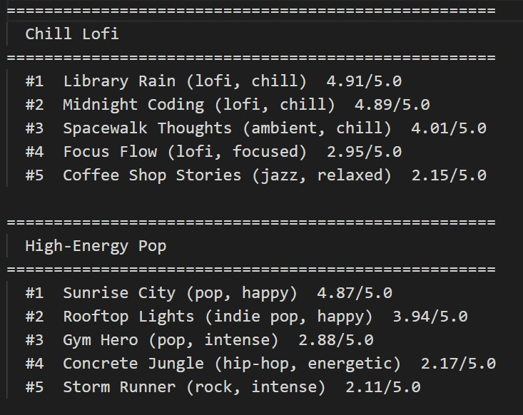
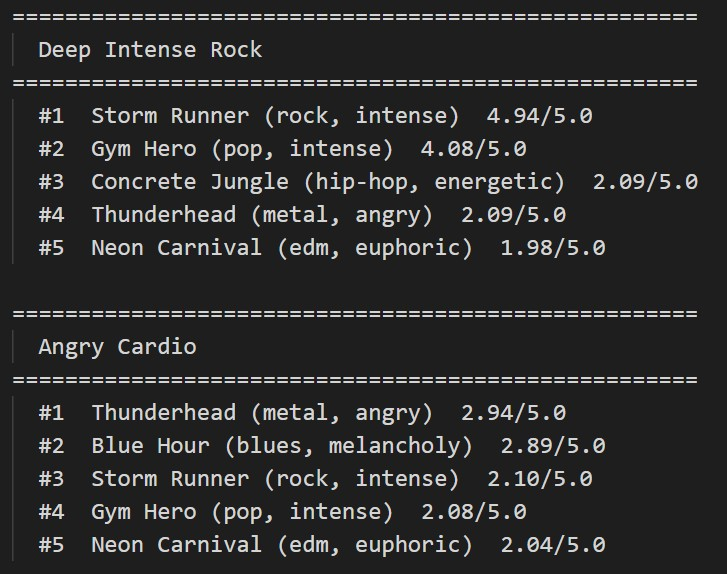
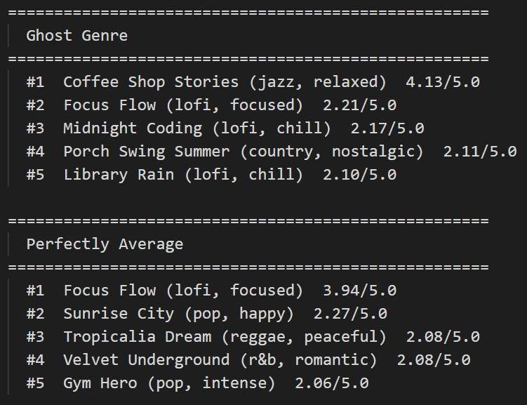
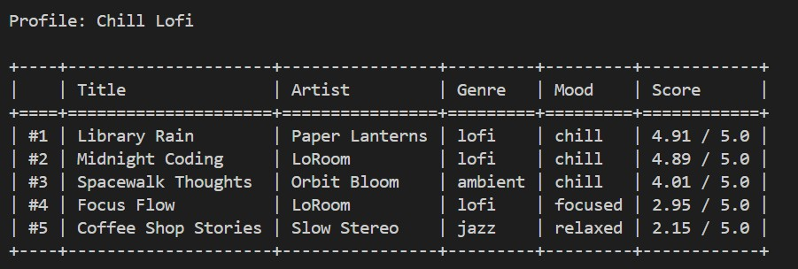

# Music Recommender Simulation

## Project Summary

This project is a content-based music recommender built in Python. It loads a catalog of 20 songs from a CSV file, scores each song against a user's taste profile using five weighted rules, and returns the top 5 matches with a plain-language explanation for each recommendation. The system was designed to be transparent — every score is broken down rule by rule so you can see exactly why a song was recommended or ranked low.

---

## How The System Works

Real-world recommenders like Spotify combine two strategies: collaborative filtering, which finds patterns across millions of users' listening histories, and content-based filtering, which analyzes the actual audio features of songs. At scale they layer in deep learning, contextual signals like time of day, and reinforcement techniques that continuously balance showing you familiar favorites against introducing something new. This simulation focuses on content-based filtering — the foundational layer that works even when there's no listening history to draw from.

This version scores each song by comparing five audio features against a user's taste profile. Mood is weighted most heavily because it is the most reliable signal across genres. Energy captures how intense the track feels. Genre gives a smaller bonus for an exact label match. Acousticness separates organic from electronic texture. Valence fine-tunes emotional positivity. Each float feature is scored using a linear penalty — the further a song's value drifts from the user's target, the lower it scores. The final recommendation is the top-k songs ranked by total score, with a human-readable explanation generated for each match.

### Song Features

| Field | Type | Range | Role in scoring |
|---|---|---|---|
| `id` | `int` | — | Unique identifier, not scored |
| `title` | `str` | — | Display only |
| `artist` | `str` | — | Display only |
| `genre` | `str` | pop, lofi, rock, jazz… | Bonus signal (+0.75 pts) |
| `mood` | `str` | happy, chill, intense… | **Primary score** (+2.0 pts) |
| `energy` | `float` | 0.0 – 1.0 | **Scored** (up to +1.5 pts) |
| `tempo_bpm` | `float` | ~60 – 200 | Correlated with energy; not scored |
| `valence` | `float` | 0.0 – 1.0 | **Scored** (up to +0.25 pts) |
| `danceability` | `float` | 0.0 – 1.0 | Available but not scored |
| `acousticness` | `float` | 0.0 – 1.0 | **Scored** (up to +0.50 pts) |

### UserProfile Features

| Field | Type | What it represents |
|---|---|---|
| `favorite_genre` | `str` | Preferred genre label |
| `mood` | `str` | Target mood for matching |
| `energy` | `float` | Desired intensity level |
| `acousticness` | `float` | Preferred organic vs. electronic texture |
| `valence` | `float` | Desired emotional positivity |
| `likes_acoustic` | `bool` | Boolean form of acousticness preference |

### Algorithm Recipe

Each song is scored against the user profile using five rules. Scores are summed for a maximum of **5.0 points**.

| Rule | Type | Max Points | Rationale |
|---|---|---|---|
| Mood match | Exact categorical | 2.00 | Most reliable cross-genre signal |
| Energy similarity | Linear float distance | 1.50 | Widest spread in the dataset; separates hype from chill |
| Genre match | Exact categorical | 0.75 | Rewards label match without dominating |
| Acousticness similarity | Linear float distance | 0.50 | Separates organic from electronic texture |
| Valence similarity | Linear float distance | 0.25 | Fine-tunes emotional tone |

Float features use a linear penalty: `score = weight × (1 - abs(song_value - target_value))`. A perfect match scores the full weight; a difference of 1.0 scores zero.

Songs are ranked by total score descending. The top `k` results are returned with a human-readable explanation listing which rules fired.

### Sample Output


## Sample Output with Stress Test




### Expected Biases

- **Mood lock-in.** Mood carries 40% of the maximum score. Songs labeled `"focused"`, `"calm"`, or `"relaxed"` score zero on mood even when they are sonically near-identical to `"chill"`. Users wanting a broad low-energy session may see qualified songs unfairly penalized.
- **Genre string fragility.** `"pop"` and `"indie pop"` do not match, so sonically similar songs in adjacent genre labels receive no genre bonus. This can make the genre rule feel arbitrary.
- **No context awareness.** The same profile scores identically at 7am and 11pm. Real platforms adjust for time-of-day and session context; this system cannot.
- **Catalog skew.** The 20-song dataset has three lofi songs and only one each of metal, classical, reggae, and soul. Users with niche tastes have fewer candidates to surface, making top-k results feel repetitive.

---

## Getting Started

### Setup

1. Create a virtual environment (optional but recommended):

   ```bash
   python -m venv .venv
   source .venv/bin/activate      # Mac or Linux
   .venv\Scripts\activate         # Windows
   ```

2. Install dependencies:

   ```bash
   pip install -r requirements.txt
   ```

3. Run the app:

   ```bash
   python -m src.main
   ```

   To test a different user profile, open `src/main.py` and change this line:

   ```python
   active_profile = "Chill Lofi"  # options: High-Energy Pop, Deep Intense Rock, Angry Cardio, Ghost Genre, Perfectly Average
   ```

### Running Tests

```bash
pytest
```

You can add more tests in `tests/test_recommender.py`.

---

## Experiments You Tried

### Experiment 1: Disabling the Mood Rule

**Change:** Commented out Rule 1 (mood exact match, +2.0 pts) so every song scored a flat 0.0 for mood regardless of match.

**Results for Chill Lofi profile:**

| Rank | WITH mood | Score | WITHOUT mood | Score |
|---|---|---|---|---|
| #1 | Library Rain (chill) | 4.91 | Focus Flow (focused) | 2.95 |
| #2 | Midnight Coding (chill) | 4.89 | Library Rain (chill) | 2.91 |
| #3 | Spacewalk Thoughts (chill) | 4.01 | Midnight Coding (chill) | 2.89 |
| #4 | Focus Flow (focused) | 2.95 | Coffee Shop Stories (relaxed) | 2.15 |
| #5 | Coffee Shop Stories (relaxed) | 2.15 | Porch Swing Summer (nostalgic) | 2.07 |

**Conclusion:** The change made recommendations *different*, not more accurate. Without mood, Focus Flow jumped to #1 purely on genre and float proximity. A country song snuck into #5 — the system lost its anchor. Mood is load-bearing: removing it collapses the score gap from ~4.9 to ~2.9 and lets acousticness drive results, surfacing plausible but wrong songs.

---

## Limitations and Risks

- **Tiny catalog.** With only 20 songs, most genres have just one representative. Users with niche tastes will always get weak results no matter how well the scoring logic works.
- **No lyric or language awareness.** The system scores audio features only. It cannot distinguish a sad song from a happy one based on what the lyrics actually say.
- **Mood lock-in.** The 2.0-point mood bonus is so large that it can override all other features, trapping users in a narrow emotional category even when sonically adjacent songs would feel just as satisfying.
- **Genre labels are fragile.** Exact string matching means "pop" and "indie pop" are treated as unrelated, which can silently exclude the best match in the catalog.

See [model_card.md](model_card.md) for a full breakdown of limitations and bias.

---

## Reflection

Building this system made it clear that recommendations are not magic but rather just weighted comparisons. The most surprising moment was running the mood experiment and watching a country song appear in a lofi playlist after one rule was disabled. That single test revealed how much of the system's "intelligence" was coming from one number.

It also changed how I think about apps like Spotify. When a recommendation feels wrong, there is probably a feature that scored unexpectedly high — not because the algorithm is broken, but because the user's stated preferences do not fully capture what they actually want in that moment. Building something simple made the complexity of real systems feel more understandable, not more mysterious.

See the full model card for detailed evaluation results, bias analysis, and ideas for future improvement:

[**Model Card**](model_card.md)

---

## Extra Optional Extensions

### Challenge 1: Add Advanced Song Features with Agent Mode

Added 5 new attributes to every song in `data/songs.csv` and built a new `"advanced"` scoring mode in `src/recommender.py` that uses them.

**New song attributes:**

| Feature | Type | Range | What it captures |
|---|---|---|---|
| `popularity` | `int` | 0–100 | Simulated stream count — how well-known the song is |
| `release_decade` | `int` | 1980–2020 | The era the song is from |
| `detailed_mood` | `str` | dreamy, euphoric, aggressive, melancholy, nostalgic, romantic, peaceful | A more precise emotional tag than the base mood label |
| `vocal_presence` | `float` | 0.0–1.0 | How prominent the vocals are (0 = instrumental, 1 = very vocal) |
| `complexity` | `float` | 0.0–1.0 | Musical and production density |

**Advanced scoring rules (max 5.0 points):**

| Rule | Points | How it works |
|---|---|---|
| Mood match | 1.50 | Exact label match (reduced from 2.0 to make room for new rules) |
| Energy similarity | up to 1.00 | Linear distance from user's target |
| Detailed mood match | 0.75 | Exact match on the nuanced mood tag |
| Decade match | 0.50 | Exact match on user's preferred era |
| Genre match | 0.50 | Exact label match |
| Vocal presence similarity | up to 0.30 | Linear distance — rewards instrumentals or vocal-heavy tracks |
| Popularity bonus | 0.25 | Only awarded if user sets `prefer_popular: True` AND song popularity >= 70 |
| Complexity similarity | up to 0.20 | Linear distance — rewards simple or dense production |

Two new advanced profiles were added: `"Advanced Lofi"` and `"Advanced Pop"`. To use the advanced mode, set both lines in `src/main.py`:

```python
active_profile = "Advanced Lofi"
active_mode    = "advanced"
```

**What the advanced mode revealed:** The `detailed_mood` tag adds real signal. In the pop profile, Neon Carnival (EDM) climbed to #3 purely because its `detailed_mood` is `"euphoric"` — matching the user's preference even though its base mood label is different. The `release_decade` rule also made a measurable difference: songs from the wrong era quietly lost 0.50 points, pushing them down in favor of newer releases even when everything else matched.

---

### Challenge 2: Create Multiple Scoring Modes
Defined six distinct taste profiles in `src/main.py` to stress-test the system. Three were normal use cases and three were edge cases designed to expose weaknesses in the scoring logic.

| Profile | Type | What it tests |
|---|---|---|
| Chill Lofi | Normal | Clear, consistent low-energy preferences |
| High-Energy Pop | Normal | Upbeat mainstream taste |
| Deep Intense Rock | Normal | High energy, dark emotional tone |
| Angry Cardio | Edge case | Conflicting preferences — high energy + melancholy mood |
| Ghost Genre | Edge case | Genre that does not exist in the catalog ("bossa nova") |
| Perfectly Average | Edge case | Every value set to the middle — tests tie-breaking |

Switching profiles only requires changing one line in `src/main.py`:

```python
active_profile = "High-Energy Pop"  # change this to any profile name above
```

The most revealing result was the Angry Cardio profile. No song in the 20-song catalog is both very high energy and melancholy at the same time. The best score it could achieve was only 2.94 out of 5.0 — the system correctly signals that the user's preferences cannot be satisfied with the available data, rather than returning a false-confident top result.

---

### Challenge 3: Diversity and Fairness Logic

Added a diversity penalty system to `src/recommender.py` that prevents the same artist or genre from dominating the top results. It is off by default and can be turned on with one line in `src/main.py`.

**How it works:**

The `apply_diversity()` function runs after all songs are scored. Instead of simply taking the top k, it uses a greedy selection loop:

1. Look at all remaining candidates and apply any earned penalties
2. Pick the highest-scoring candidate after penalties
3. Record that artist and genre as "seen"
4. Repeat until k songs are selected

**Penalty rules:**

| Situation | Penalty |
|---|---|
| Song's artist is already in the results | -1.5 pts |
| Song's genre has appeared 2 or more times already | -0.8 pts |

**Before vs. after (Chill Lofi profile):**

| Rank | Diversity OFF | Score | Diversity ON | Score |
|---|---|---|---|---|
| #1 | Library Rain (Paper Lanterns) | 4.91 | Library Rain (Paper Lanterns) | 4.91 |
| #2 | Midnight Coding (LoRoom) | 4.89 | Midnight Coding (LoRoom) | 4.89 |
| #3 | Spacewalk Thoughts (Orbit Bloom) | 4.01 | Spacewalk Thoughts (Orbit Bloom) | 4.01 |
| #4 | **Focus Flow (LoRoom)** | 2.95 | **Coffee Shop Stories (Slow Stereo)** | 2.15 |
| #5 | Coffee Shop Stories (Slow Stereo) | 2.15 | **Porch Swing Summer (The Dalloway)** | 2.07 |

Focus Flow was penalized -1.5 pts because LoRoom already appeared at #2, dropping its effective score from 2.95 to 1.45. Coffee Shop Stories and Porch Swing Summer — both new artists — moved up instead.

To enable it in `src/main.py`:

```python
use_diversity = True
```

---

### Challenge 4: Visual Summary Table

Improved the terminal output by adding a formatted table using the `tabulate` library. Instead of printing each recommendation as a block of text, the output now shows a clean summary table with all five results side by side — title, artist, genre, mood, and score — followed by a detailed score breakdown for each song listing every rule that fired and how many points it contributed.

