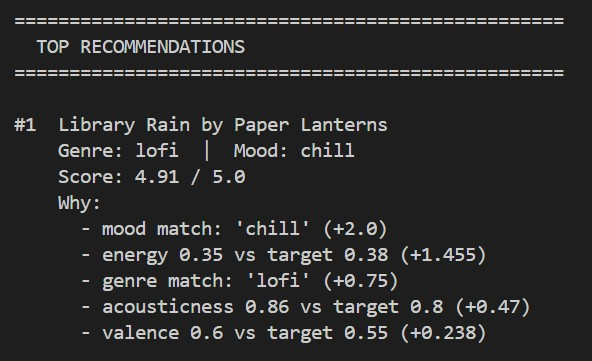
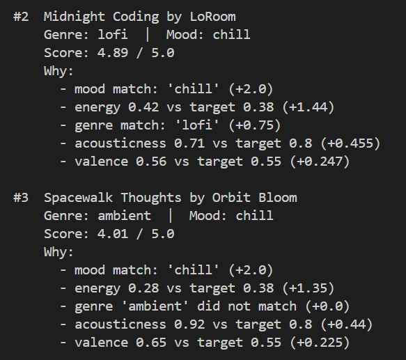
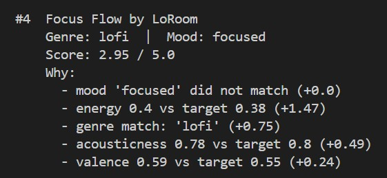
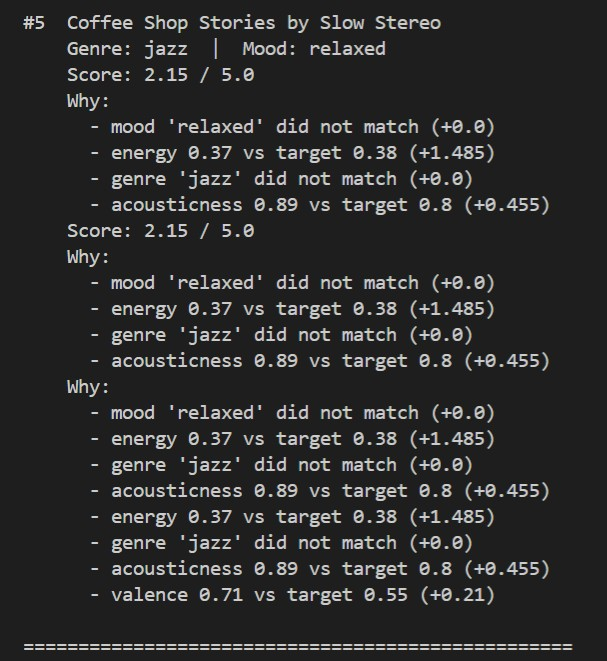

# 🎵 Music Recommender Simulation

## Project Summary

In this project you will build and explain a small music recommender system.

Your goal is to:

- Represent songs and a user "taste profile" as data
- Design a scoring rule that turns that data into recommendations
- Evaluate what your system gets right and wrong
- Reflect on how this mirrors real world AI recommenders

Replace this paragraph with your own summary of what your version does.

---

## How The System Works

Real-world recommenders like Spotify combine two strategies: collaborative filtering, which finds patterns across millions of users' listening histories, and content-based filtering, which analyzes the actual audio features of songs. At scale they layer in deep learning, contextual signals like time of day, and reinforcement techniques that continuously balance showing you familiar favorites against introducing something new. This simulation focuses on content-based filtering — the foundational layer that works even when there's no listening history to draw from.

This version scores each song by comparing four audio features against a user's taste profile: **mood** (an exact-match categorical check weighted most heavily at 35%), **energy** (how intense the track feels, 30%), **valence** (the emotional positivity of the song, 20%), and **acousticness** (organic vs. electronic texture, 15%). Each float feature is scored using a linear penalty — the further a song's value drifts from the user's target, the lower it scores. The final recommendation is the top-k songs ranked by total score, with a human-readable explanation generated for each match. The system prioritizes **transparency and interpretability**: every recommendation comes with a reason, and the scoring weights are explicit rather than hidden inside a neural network.

### Song Features

| Field | Type | Range | Role in scoring |
|---|---|---|---|
| `id` | `int` | — | Unique identifier, not scored |
| `title` | `str` | — | Display only |
| `artist` | `str` | — | Display only |
| `genre` | `str` | pop, lofi, rock, jazz… | Bonus signal (+0.75 pts) |
| `mood` | `str` | happy, chill, intense… | **Primary score** (+2.0 pts) |
| `energy` | `float` | 0.0 – 1.0 | **Scored** (up to +1.5 pts) |
| `tempo_bpm` | `float` | ~60 – 200 | Correlated with energy; not scored |
| `valence` | `float` | 0.0 – 1.0 | **Scored** (up to +0.25 pts) |
| `danceability` | `float` | 0.0 – 1.0 | Available but not scored |
| `acousticness` | `float` | 0.0 – 1.0 | **Scored** (up to +0.50 pts) |

### UserProfile Features

| Field | Type | What it represents |
|---|---|---|
| `favorite_genre` | `str` | Preferred genre label |
| `mood` | `str` | Target mood for matching |
| `energy` | `float` | Desired intensity level |
| `acousticness` | `float` | Preferred organic vs. electronic texture |
| `valence` | `float` | Desired emotional positivity |
| `likes_acoustic` | `bool` | Boolean form of acousticness preference |

### Algorithm Recipe

Each song is scored against the user profile using five rules. Scores are summed for a maximum of **5.0 points**.

| Rule | Type | Max Points | Rationale |
|---|---|---|---|
| Mood match | Exact categorical | 2.00 | Most reliable cross-genre signal |
| Energy similarity | Linear float distance | 1.50 | Widest spread in the dataset; separates hype from chill |
| Genre match | Exact categorical | 0.75 | Rewards label match without dominating |
| Acousticness similarity | Linear float distance | 0.50 | Separates organic from electronic texture |
| Valence similarity | Linear float distance | 0.25 | Fine-tunes emotional tone |

Float features use a linear penalty: `score = weight × (1 - abs(song_value - target_value))`. A perfect match scores the full weight; a difference of 1.0 scores zero.

Songs are ranked by total score descending. The top `k` results are returned with a human-readable explanation listing which rules fired.

### Sample Output






### Expected Biases

- **Mood lock-in.** Mood carries 40% of the maximum score. Songs labeled `"focused"`, `"calm"`, or `"relaxed"` score zero on mood even when they are sonically near-identical to `"chill"`. Users wanting a broad low-energy session may see qualified songs unfairly penalized.
- **Genre string fragility.** `"pop"` and `"indie pop"` do not match, so sonically similar songs in adjacent genre labels receive no genre bonus. This can make the genre rule feel arbitrary.
- **No context awareness.** The same profile scores identically at 7am and 11pm. Real platforms adjust for time-of-day and session context; this system cannot.
- **Catalog skew.** The 20-song dataset has three lofi songs and only one each of metal, classical, reggae, and soul. Users with niche tastes have fewer candidates to surface, making top-k results feel repetitive.

---

## Getting Started

### Setup

1. Create a virtual environment (optional but recommended):

   ```bash
   python -m venv .venv
   source .venv/bin/activate      # Mac or Linux
   .venv\Scripts\activate         # Windows

2. Install dependencies

```bash
pip install -r requirements.txt
```

3. Run the app:

```bash
python -m src.main
```

### Running Tests

Run the starter tests with:

```bash
pytest
```

You can add more tests in `tests/test_recommender.py`.

---

## Experiments You Tried

Use this section to document the experiments you ran. For example:

- What happened when you changed the weight on genre from 2.0 to 0.5
- What happened when you added tempo or valence to the score
- How did your system behave for different types of users

---

## Limitations and Risks

Summarize some limitations of your recommender.

Examples:

- It only works on a tiny catalog
- It does not understand lyrics or language
- It might over favor one genre or mood

You will go deeper on this in your model card.

---

## Reflection

Read and complete `model_card.md`:

[**Model Card**](model_card.md)

Write 1 to 2 paragraphs here about what you learned:

- about how recommenders turn data into predictions
- about where bias or unfairness could show up in systems like this


---

## 7. `model_card_template.md`

Combines reflection and model card framing from the Module 3 guidance. :contentReference[oaicite:2]{index=2}  

```markdown
# 🎧 Model Card - Music Recommender Simulation

## 1. Model Name

Give your recommender a name, for example:

> VibeFinder 1.0

---

## 2. Intended Use

- What is this system trying to do
- Who is it for

Example:

> This model suggests 3 to 5 songs from a small catalog based on a user's preferred genre, mood, and energy level. It is for classroom exploration only, not for real users.

---

## 3. How It Works (Short Explanation)

Describe your scoring logic in plain language.

- What features of each song does it consider
- What information about the user does it use
- How does it turn those into a number

Try to avoid code in this section, treat it like an explanation to a non programmer.

---

## 4. Data

Describe your dataset.

- How many songs are in `data/songs.csv`
- Did you add or remove any songs
- What kinds of genres or moods are represented
- Whose taste does this data mostly reflect

---

## 5. Strengths

Where does your recommender work well

You can think about:
- Situations where the top results "felt right"
- Particular user profiles it served well
- Simplicity or transparency benefits

---

## 6. Limitations and Bias

Where does your recommender struggle

Some prompts:
- Does it ignore some genres or moods
- Does it treat all users as if they have the same taste shape
- Is it biased toward high energy or one genre by default
- How could this be unfair if used in a real product

---

## 7. Evaluation

How did you check your system

Examples:
- You tried multiple user profiles and wrote down whether the results matched your expectations
- You compared your simulation to what a real app like Spotify or YouTube tends to recommend
- You wrote tests for your scoring logic

You do not need a numeric metric, but if you used one, explain what it measures.

---

## 8. Future Work

If you had more time, how would you improve this recommender

Examples:

- Add support for multiple users and "group vibe" recommendations
- Balance diversity of songs instead of always picking the closest match
- Use more features, like tempo ranges or lyric themes

---

## 9. Personal Reflection

A few sentences about what you learned:

- What surprised you about how your system behaved
- How did building this change how you think about real music recommenders
- Where do you think human judgment still matters, even if the model seems "smart"

