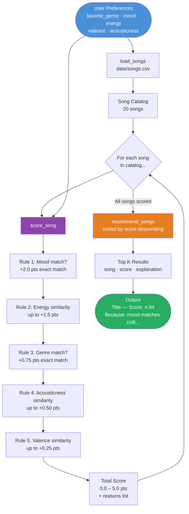

# Data Flow: Music Recommender Simulation

## Mermaid.js Flowchart



---

## Written Map

```
User Preferences (main.py:19)
        │
        ▼
load_songs("data/songs.csv")          ← reads 20 songs into List[Dict]
        │
        ▼
FOR EACH song in catalog:
    score_song(user_prefs, song)       ← recommender.py:57
        ├─ Rule 1: mood match?         → +2.00 pts
        ├─ Rule 2: energy distance     → up to +1.50 pts
        ├─ Rule 3: genre match?        → +0.75 pts
        ├─ Rule 4: acousticness dist.  → up to +0.50 pts
        └─ Rule 5: valence distance    → up to +0.25 pts
    returns (score, reasons)
        │
        ▼
scored_songs = [(song, score, reasons), ...]   ← 20 entries
        │
        ▼
recommend_songs sorts by score DESC            ← recommender.py:66
takes top k=5
        │
        ▼
Output: [(song, 4.94, ["mood matches 'chill'", ...]), ...]
```
